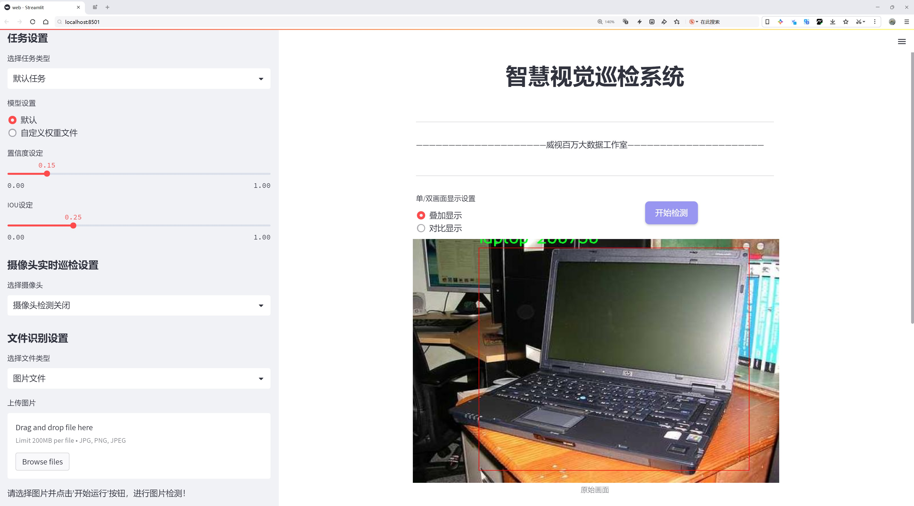
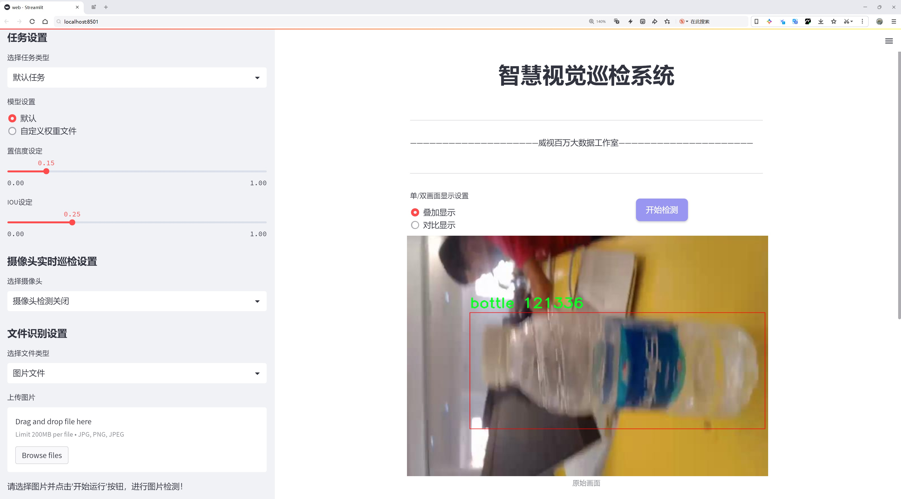
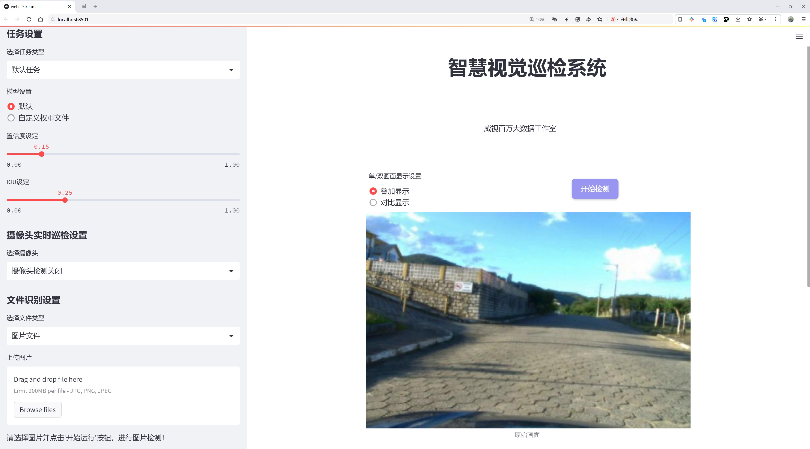
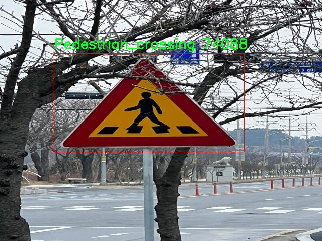
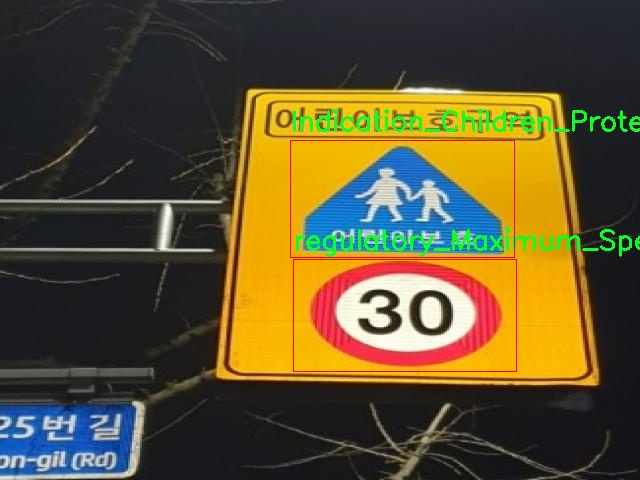
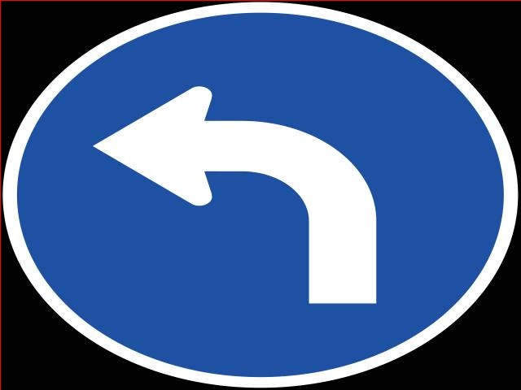
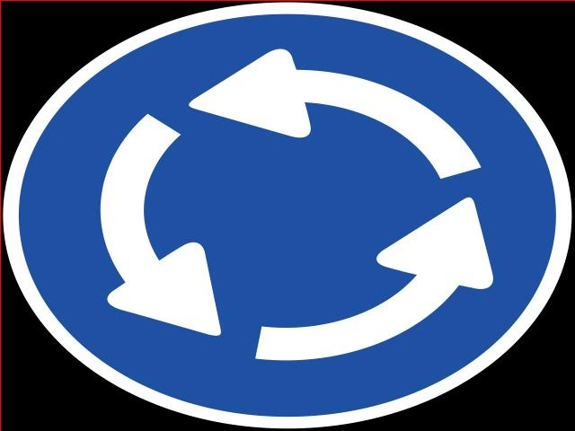
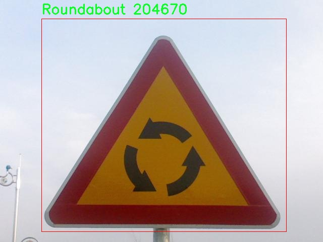

# 车辆行人转向意图状态检测检测系统源码分享
 # [一条龙教学YOLOV8标注好的数据集一键训练_70+全套改进创新点发刊_Web前端展示]

### 1.研究背景与意义

项目参考[AAAI Association for the Advancement of Artificial Intelligence](https://gitee.com/qunmasj/projects)

项目来源[AACV Association for the Advancement of Computer Vision](https://kdocs.cn/l/cszuIiCKVNis)

研究背景与意义

随着城市化进程的加快，交通拥堵、交通事故频发等问题日益严重，给城市交通管理带来了巨大的挑战。车辆与行人之间的互动关系日益复杂，尤其是在交叉路口、行人过街道等关键场景中，如何准确识别和预测车辆及行人的转向意图状态，成为提升交通安全和效率的重要课题。传统的交通监控手段往往依赖于人工观察和简单的传感器，难以实现实时、准确的状态检测。因此，基于计算机视觉和深度学习技术的智能交通系统逐渐成为研究的热点。

YOLO（You Only Look Once）系列目标检测算法因其高效性和准确性，广泛应用于实时目标检测任务。YOLOv8作为该系列的最新版本，具备更强的特征提取能力和更快的推理速度，适合在复杂的交通场景中进行车辆和行人的状态检测。然而，现有的YOLOv8模型在处理车辆和行人转向意图的检测时，仍存在一定的局限性，尤其是在复杂背景、遮挡物以及多目标情况下的识别精度有待提高。因此，改进YOLOv8以适应车辆行人转向意图状态检测的需求，具有重要的理论和实践意义。

本研究将利用包含2100张图像的多类别数据集，涵盖了125个类别，包括交通标志、道路指示、行人、车辆等多种元素。这些类别不仅为模型提供了丰富的训练样本，还能有效增强模型对复杂交通场景的适应能力。通过对数据集的深入分析，我们可以提取出与车辆和行人转向意图相关的特征信息，从而提升模型的检测精度。此外，数据集中包含的多种交通指示标志和场景信息，将为模型提供更为全面的上下文理解能力，使其能够在不同的交通环境中做出更为准确的判断。

在研究的意义上，基于改进YOLOv8的车辆行人转向意图状态检测系统，不仅可以提高交通监控的智能化水平，还能为智能交通系统的建设提供技术支持。通过实时检测和预测车辆与行人的转向意图，能够有效减少交通事故的发生，提升道路安全性。同时，该系统的应用还可以为交通管理部门提供决策支持，优化交通信号控制，缓解交通拥堵，提升城市交通的整体效率。

综上所述，本研究在技术创新和实际应用方面具有重要的意义。通过改进YOLOv8模型，结合丰富的数据集信息，旨在构建一个高效、准确的车辆行人转向意图状态检测系统，为智能交通的发展贡献新的思路和方法。

### 2.图片演示







##### 注意：由于此博客编辑较早，上面“2.图片演示”和“3.视频演示”展示的系统图片或者视频可能为老版本，新版本在老版本的基础上升级如下：（实际效果以升级的新版本为准）

  （1）适配了YOLOV8的“目标检测”模型和“实例分割”模型，通过加载相应的权重（.pt）文件即可自适应加载模型。

  （2）支持“图片识别”、“视频识别”、“摄像头实时识别”三种识别模式。

  （3）支持“图片识别”、“视频识别”、“摄像头实时识别”三种识别结果保存导出，解决手动导出（容易卡顿出现爆内存）存在的问题，识别完自动保存结果并导出到tempDir中。

  （4）支持Web前端系统中的标题、背景图等自定义修改，后面提供修改教程。

  另外本项目提供训练的数据集和训练教程,暂不提供权重文件（best.pt）,需要您按照教程进行训练后实现图片演示和Web前端界面演示的效果。

### 3.视频演示

[3.1 视频演示](https://www.bilibili.com/video/BV1TktUe2Eiw/)

### 4.数据集信息展示

##### 4.1 本项目数据集详细数据（类别数＆类别名）

nc: 98
names: ['Airplanes', 'Beginning_of_center_divider', 'Bicycles', 'Both_ways', 'Curve_to_right', 'Curving_left', 'Danger', 'Double_curve_left', 'Double_curve_right', 'Downward_slope', 'Drive_both_sides', 'Drive_to_the_right', 'End_of_center_divider_side', 'Falling_rocks', 'Four-way_intersection', 'Indication_Bicycle_crossing', 'Indication_Bicycle_parking_area', 'Indication_Bicycles_only', 'Indication_Bus_only_lane', 'Indication_Children_Protection', 'Indication_Drive_both_the_right', 'Indication_Drive_on_the_left', 'Indication_Drive_on_the_right', 'Indication_Go_straight_or_left_turn', 'Indication_Go_straight_or_right_turn', 'Indication_HOV_Lane', 'Indication_Left_or_right_turn', 'Indication_Make_left_turn', 'Indication_Make_right_turn', 'Indication_One_way_left', 'Indication_One_way_right', 'Indication_One_way_straight', 'Indication_Parking_area', 'Indication_Pedestrian_crossing', 'Indication_Pedestrian_only', 'Indication_Priority', 'Indication_Proceeding_direction', 'Indication_Roundabout_straight', 'Indication_Safety_area', 'Indication_Safety_for_children', 'Indication_Unprotected_left_turn', 'Indication_Use_the_snow_tire_chain', 'Indication_Vehicles_only', 'Indication_for_bicycles_and_pedestrians', 'Indication_u-turn_ways', 'Left_lane_is_merged', 'Merge_left', 'Merge_right', 'Narrow_road_ahead', 'Pedestrian_crossing', 'Poth-hole', 'Prionity', 'Railroad_crossing', 'Right_lane_is_merged', 'Riverside_drive', 'Road_construction', 'Rough_road_condition', 'Roundabout', 'Safety_for_children', 'Safety_for_wild_animals', 'Slippery_road', 'Speed_bump_ahead', 'T-shaped_intersection', 'Traffic_signal', 'Tree-way_intersection_left', 'Tree-way_intersection_right', 'Tunnel', 'Upward_slope', 'Wet_road_condition', 'Wind', 'Y-shaped_intersection', 'apple', 'banana', 'book', 'bottle', 'car', 'cars', 'cat', 'cycle', 'dog', 'grape', 'indication_protection_of_the_disabled', 'indication_protection_of_the_elderly', 'laptop', 'orange', 'person', 'regulatory_Distance_between_the_vehicles', 'regulatory_Drive_slowly', 'regulatory_Maximum_Speed_limit', 'regulatory_No_left_turn', 'regulatory_No_parking', 'regulatory_No_passage', 'regulatory_No_right_turn', 'regulatory_No_stop_or_parking', 'regulatory_Stop', 'regulatory_Yield', 'traffic sign', 'trafficlight']


##### 4.2 本项目数据集信息介绍

数据集信息展示

在构建改进YOLOv8的车辆行人转向意图状态检测系统的过程中，所使用的数据集名为“object”。该数据集的设计旨在为自动驾驶和智能交通系统提供丰富的视觉信息，以便更好地理解和预测车辆及行人的行为。数据集包含98个类别，涵盖了多种交通标志、道路状况、交通工具及其他相关对象，极大地增强了模型的学习能力和泛化能力。

首先，数据集中包括了多种交通标志和指示，诸如“Indication_Go_straight_or_left_turn”、“Indication_Pedestrian_crossing”和“Indication_Safety_area”等。这些类别的存在使得模型能够识别出道路上的各种指示信息，从而在复杂的交通环境中做出更为准确的决策。例如，当车辆接近一个人行横道时，模型能够及时识别出“Indication_Pedestrian_crossing”标志，并做出相应的减速或停车的反应。这对于提高行人安全和减少交通事故的发生具有重要意义。

此外，数据集中还包含了与道路状况相关的类别，如“Slippery_road”、“Poth-hole”和“Rough_road_condition”。这些类别的引入使得模型不仅能够识别静态的交通标志，还能感知动态的道路环境变化。这种能力在实际应用中尤为重要，因为道路条件的变化可能会直接影响车辆的行驶安全和行驶策略。例如，在识别到“Slippery_road”时，系统可以自动调整车辆的行驶速度和操控方式，以降低事故风险。

在交通工具的分类方面，数据集同样提供了丰富的选择，包括“car”、“bicycle”、“person”等。这些类别的多样性使得模型能够在复杂的交通场景中有效区分不同类型的交通参与者，从而更好地理解其行为意图。例如，识别到“bicycle”后，系统可以预测骑行者可能的转向行为，从而提前做出反应，避免潜在的碰撞。

数据集中的类别还包括了一些特定的交通法规指示，如“regulatory_No_left_turn”、“regulatory_Maximum_Speed_limit”等。这些类别的存在不仅为模型提供了交通规则的背景知识，还使得模型能够在特定情况下做出合规的决策。例如，当车辆接近一个禁止左转的路口时，系统能够识别出“regulatory_No_left_turn”标志，并自动调整行驶路线，确保遵守交通法规。

最后，数据集还包含了一些日常物品的类别，如“apple”、“banana”、“laptop”等，这些类别的引入虽然与交通直接相关性较低，但在某些特定场景下，可能会对模型的学习和识别能力产生积极影响。这种多样性使得模型在处理不同类型的输入时，能够保持更高的灵活性和适应性。

综上所述，数据集“object”通过其丰富的类别设置，为改进YOLOv8的车辆行人转向意图状态检测系统提供了强有力的支持。通过对多种交通标志、道路状况和交通工具的全面覆盖，该数据集不仅增强了模型的识别能力，还提升了其在复杂交通环境中的决策能力，为未来的智能交通系统奠定了坚实的基础。











### 5.全套项目环境部署视频教程（零基础手把手教学）

[5.1 环境部署教程链接（零基础手把手教学）](https://www.ixigua.com/7404473917358506534?logTag=c807d0cbc21c0ef59de5)


[5.2 安装Python虚拟环境创建和依赖库安装视频教程链接（零基础手把手教学）](https://www.ixigua.com/7404474678003106304?logTag=1f1041108cd1f708b01a)

### 6.手把手YOLOV8训练视频教程（零基础小白有手就能学会）

[6.1 手把手YOLOV8训练视频教程（零基础小白有手就能学会）](https://www.ixigua.com/7404477157818401292?logTag=d31a2dfd1983c9668658)

### 7.70+种全套YOLOV8创新点代码加载调参视频教程（一键加载写好的改进模型的配置文件）

[7.1 70+种全套YOLOV8创新点代码加载调参视频教程（一键加载写好的改进模型的配置文件）](https://www.ixigua.com/7404478314661806627?logTag=29066f8288e3f4eea3a4)

### 8.70+种全套YOLOV8创新点原理讲解（非科班也可以轻松写刊发刊，V10版本正在科研待更新）

由于篇幅限制，每个创新点的具体原理讲解就不一一展开，具体见下列网址中的创新点对应子项目的技术原理博客网址【Blog】：


[8.1 70+种全套YOLOV8创新点原理讲解链接](https://gitee.com/qunmasj/good)

### 9.系统功能展示（检测对象为举例，实际内容以本项目数据集为准）

图9.1.系统支持检测结果表格显示

  图9.2.系统支持置信度和IOU阈值手动调节

  图9.3.系统支持自定义加载权重文件best.pt(需要你通过步骤5中训练获得)

  图9.4.系统支持摄像头实时识别

  图9.5.系统支持图片识别

  图9.6.系统支持视频识别

  图9.7.系统支持识别结果文件自动保存

  图9.8.系统支持Excel导出检测结果数据


### 10.原始YOLOV8算法原理

原始YOLOv8算法原理

YOLOv8作为YOLO系列的最新版本，标志着目标检测技术的又一次飞跃。它在保持高效性的同时，显著提升了检测精度和速度，成为计算机视觉领域中的一颗璀璨明珠。与其前身YOLOv5相比，YOLOv8不仅在模型结构上进行了深度优化，还在算法设计上引入了多项创新，使其在各种应用场景中展现出卓越的性能。

YOLOv8的网络结构可以分为四个主要部分：输入端、骨干网络、颈部网络和头部网络。输入端的设计尤为重要，它通过马赛克数据增强、自适应锚框计算和自适应灰度填充等技术，确保了输入数据的多样性和适应性。这一过程不仅提升了模型的鲁棒性，还为后续的特征提取打下了坚实的基础。

在骨干网络方面，YOLOv8采用了C2f结构，取代了YOLOv5中的C3模块。C2f模块通过引入更多的分支和跨层连接，增强了梯度流的丰富性，从而提升了特征表示能力。这种结构的设计灵感来源于YOLOv7的ELAN结构，充分利用了残差特征的学习，形成了一个更为强大的神经网络模块。此外，YOLOv8还引入了空间金字塔池化融合（SPPF）结构，进一步增强了对多尺度特征的捕捉能力，使得模型在处理不同大小目标时表现得更加出色。

颈部网络则采用了路径聚合网络（PAN）结构，这一设计有效地增强了网络对不同缩放尺度对象的特征融合能力。通过对特征图的有效聚合，YOLOv8能够更好地整合来自不同层次的信息，从而提升检测的准确性和稳定性。

头部网络是YOLOv8的一大亮点，它将分类和检测过程进行了有效的解耦。这一创新使得模型在处理复杂场景时，能够更专注于各自的任务，减少了定位不准和分类错误的概率。YOLOv8的头部网络主要包括损失计算和目标检测框筛选两个部分。在损失计算过程中，YOLOv8采用了Task-Aligned Assigner策略，根据分类与回归的分数加权结果选择正样本，从而优化了正负样本的分配。损失计算涵盖了分类和回归两个分支，其中分类分支使用了二元交叉熵损失（BCELoss），而回归分支则结合了分布焦点损失（DFLoss）和完全交并比损失函数（CIOULoss），进一步提升了模型对边界框预测的精准性。

YOLOv8在目标检测方法上也进行了重大创新，采用了Anchor-Free的检测策略。这一方法通过直接预测目标的位置和大小，省去了传统方法中对锚框的依赖，简化了模型的设计。与传统的Anchor-Based方法相比，Anchor-Free方法能够更快速地聚焦于目标位置的邻近点，使得预测框更接近于实际边界框区域。这一转变不仅提升了检测速度，也减少了锚框预测的数量，从而加速了非最大抑制（NMS）过程，进一步提高了实时检测的效率。

值得一提的是，YOLOv8在模型的轻量化方面也取得了显著进展。相较于之前的YOLO系列，YOLOv8的权重文件得到了进一步的压缩，使其能够在各种嵌入式设备上高效运行。这一特性使得YOLOv8在实际应用中，能够满足对实时性和精度的双重需求，广泛适用于智能监控、自动驾驶、无人机巡检等多个领域。

综上所述，YOLOv8通过对网络结构的深度优化、创新的检测方法以及轻量化设计，展现出了卓越的性能。它不仅继承了YOLO系列的优良传统，还在此基础上进行了全面的改进，成为当前目标检测领域的佼佼者。随着YOLOv8的推广与应用，未来的目标检测技术将更加高效、精准，为各行各业的智能化发展提供强有力的支持。


### 11.项目核心源码讲解（再也不用担心看不懂代码逻辑）

#### 11.1 70+种YOLOv8算法改进源码大全和调试加载训练教程（非必要）\ultralytics\models\fastsam\predict.py

以下是经过精简和注释的核心代码部分：

```python
# 导入必要的库
import torch
from ultralytics.engine.results import Results
from ultralytics.models.fastsam.utils import bbox_iou
from ultralytics.models.yolo.detect.predict import DetectionPredictor
from ultralytics.utils import ops

class FastSAMPredictor(DetectionPredictor):
    """
    FastSAMPredictor类专门用于在Ultralytics YOLO框架中进行快速SAM（Segment Anything Model）分割预测任务。
    该类继承自DetectionPredictor，定制了预测管道以适应快速SAM，调整后处理步骤以结合掩码预测和非最大抑制。
    """

    def __init__(self, cfg=DEFAULT_CFG, overrides=None, _callbacks=None):
        """
        初始化FastSAMPredictor类，设置任务为'分割'。
        
        Args:
            cfg (dict): 预测的配置参数。
            overrides (dict, optional): 可选的参数覆盖，用于自定义行为。
            _callbacks (dict, optional): 在预测过程中调用的可选回调函数列表。
        """
        super().__init__(cfg, overrides, _callbacks)
        self.args.task = 'segment'  # 设置任务为分割

    def postprocess(self, preds, img, orig_imgs):
        """
        对预测结果进行后处理，包括非最大抑制和将框缩放到原始图像大小，并返回最终结果。
        
        Args:
            preds (list): 模型的原始输出预测。
            img (torch.Tensor): 处理后的图像张量。
            orig_imgs (list | torch.Tensor): 原始图像或图像列表。
        
        Returns:
            (list): 包含处理后的框、掩码和其他元数据的Results对象列表。
        """
        # 应用非最大抑制，过滤掉低置信度的预测
        p = ops.non_max_suppression(
            preds[0],
            self.args.conf,
            self.args.iou,
            agnostic=self.args.agnostic_nms,
            max_det=self.args.max_det,
            nc=1,  # SAM没有类别预测，因此设置为1类
            classes=self.args.classes)

        # 创建一个全框，用于后续的IOU计算
        full_box = torch.zeros(p[0].shape[1], device=p[0].device)
        full_box[2], full_box[3], full_box[4], full_box[6:] = img.shape[3], img.shape[2], 1.0, 1.0
        full_box = full_box.view(1, -1)

        # 计算IOU并更新full_box
        critical_iou_index = bbox_iou(full_box[0][:4], p[0][:, :4], iou_thres=0.9, image_shape=img.shape[2:])
        if critical_iou_index.numel() != 0:
            full_box[0][4] = p[0][critical_iou_index][:, 4]
            full_box[0][6:] = p[0][critical_iou_index][:, 6:]
            p[0][critical_iou_index] = full_box

        # 如果输入图像是张量而不是列表，则转换为numpy格式
        if not isinstance(orig_imgs, list):
            orig_imgs = ops.convert_torch2numpy_batch(orig_imgs)

        results = []  # 存储最终结果
        proto = preds[1][-1] if len(preds[1]) == 3 else preds[1]  # 获取掩码原型

        # 遍历每个预测，处理并生成结果
        for i, pred in enumerate(p):
            orig_img = orig_imgs[i]  # 获取原始图像
            img_path = self.batch[0][i]  # 获取图像路径
            
            if not len(pred):  # 如果没有预测框
                masks = None
            elif self.args.retina_masks:  # 使用Retina掩码处理
                pred[:, :4] = ops.scale_boxes(img.shape[2:], pred[:, :4], orig_img.shape)  # 缩放框
                masks = ops.process_mask_native(proto[i], pred[:, 6:], pred[:, :4], orig_img.shape[:2])  # 处理掩码
            else:  # 常规掩码处理
                masks = ops.process_mask(proto[i], pred[:, 6:], pred[:, :4], img.shape[2:], upsample=True)  # 处理掩码
                pred[:, :4] = ops.scale_boxes(img.shape[2:], pred[:, :4], orig_img.shape)  # 缩放框
            
            # 将结果存储到Results对象中
            results.append(Results(orig_img, path=img_path, names=self.model.names, boxes=pred[:, :6], masks=masks))
        
        return results  # 返回最终结果列表
```

### 代码分析：
1. **类定义**：`FastSAMPredictor`类继承自`DetectionPredictor`，专门用于快速SAM分割任务。
2. **初始化方法**：在初始化时设置任务为分割，并调用父类的初始化方法。
3. **后处理方法**：`postprocess`方法对模型的预测结果进行后处理，包括：
   - 应用非最大抑制以去除低置信度的框。
   - 计算IOU以更新框的属性。
   - 处理掩码并将结果存储在`Results`对象中，最终返回处理后的结果列表。

以上是对代码的核心部分进行了提炼和详细注释，帮助理解其功能和逻辑。

该文件定义了一个名为 `FastSAMPredictor` 的类，专门用于在 Ultralytics YOLO 框架中执行快速的 SAM（Segment Anything Model）分割预测任务。这个类继承自 `DetectionPredictor`，并针对快速 SAM 进行了定制化的预测流程。

在初始化方法 `__init__` 中，`FastSAMPredictor` 类调用了父类的构造函数，并将任务类型设置为“分割”。它接受三个参数：配置参数 `cfg`，可选的参数覆盖 `overrides`，以及可选的回调函数 `_callbacks`，这些参数用于自定义预测行为。

`postprocess` 方法是该类的核心功能之一，负责对模型的原始输出进行后处理，包括非极大值抑制（NMS）和将边界框缩放到原始图像大小。该方法接收三个参数：`preds`（模型的原始输出），`img`（处理后的图像张量），以及 `orig_imgs`（原始图像或图像列表）。在方法内部，首先使用非极大值抑制对预测结果进行处理，筛选出置信度高的检测框。接着，创建一个全框（`full_box`），并根据输入图像的尺寸进行初始化。

接下来，使用 `bbox_iou` 函数计算与全框的 IOU（Intersection over Union），并根据阈值更新全框的值。随后，如果输入的原始图像不是列表，则将其转换为 NumPy 格式。最后，方法会遍历每个预测结果，处理掩膜并将最终结果存储在 `results` 列表中。每个结果都包含了原始图像、路径、类别名称、边界框和掩膜信息。

总的来说，这个文件实现了快速 SAM 分割预测的后处理逻辑，旨在优化单类分割任务的性能，并在 Ultralytics YOLO 框架中提供高效的预测功能。

#### 11.2 ui.py

以下是代码中最核心的部分，并附上详细的中文注释：

```python
import sys
import subprocess

def run_script(script_path):
    """
    使用当前 Python 环境运行指定的脚本。

    Args:
        script_path (str): 要运行的脚本路径

    Returns:
        None
    """
    # 获取当前 Python 解释器的路径
    python_path = sys.executable

    # 构建运行命令，使用 streamlit 运行指定的脚本
    command = f'"{python_path}" -m streamlit run "{script_path}"'

    # 执行命令
    result = subprocess.run(command, shell=True)
    # 检查命令执行的返回码，如果不为0则表示出错
    if result.returncode != 0:
        print("脚本运行出错。")

# 实例化并运行应用
if __name__ == "__main__":
    # 指定要运行的脚本路径
    script_path = "web.py"  # 这里可以直接指定脚本名

    # 调用函数运行脚本
    run_script(script_path)
```

### 代码注释说明：
1. **导入模块**：
   - `sys`：用于访问与 Python 解释器相关的变量和函数。
   - `subprocess`：用于执行外部命令和与其交互。

2. **定义 `run_script` 函数**：
   - 该函数接受一个参数 `script_path`，表示要运行的 Python 脚本的路径。
   - 使用 `sys.executable` 获取当前 Python 解释器的路径，以确保在正确的环境中运行脚本。
   - 构建一个命令字符串，使用 `streamlit` 模块运行指定的脚本。
   - 使用 `subprocess.run` 执行构建的命令，并检查返回码以判断脚本是否成功运行。

3. **主程序入口**：
   - 使用 `if __name__ == "__main__":` 确保该代码块仅在直接运行脚本时执行。
   - 指定要运行的脚本路径（这里为 `web.py`）。
   - 调用 `run_script` 函数来执行指定的脚本。

这个程序文件名为 `ui.py`，其主要功能是通过当前的 Python 环境运行一个指定的脚本，具体是一个名为 `web.py` 的文件。程序首先导入了必要的模块，包括 `sys`、`os` 和 `subprocess`，以及一个自定义的 `abs_path` 函数，用于获取脚本的绝对路径。

在 `run_script` 函数中，首先获取当前 Python 解释器的路径，这通过 `sys.executable` 实现。接着，构建一个命令字符串，该命令用于运行 `streamlit`，这是一个用于构建和分享数据应用的框架。命令的格式为 `"{python_path}" -m streamlit run "{script_path}"`，其中 `python_path` 是当前 Python 解释器的路径，`script_path` 是要运行的脚本路径。

然后，使用 `subprocess.run` 方法执行构建好的命令。这个方法会在新的 shell 中运行命令，并等待其完成。如果命令执行的返回码不为零，表示脚本运行过程中出现了错误，程序会打印出“脚本运行出错。”的提示信息。

在文件的最后部分，使用 `if __name__ == "__main__":` 来判断当前模块是否是主程序。如果是，则指定要运行的脚本路径为 `web.py` 的绝对路径，并调用 `run_script` 函数来执行该脚本。这样设计使得该文件可以作为一个独立的脚本运行，同时也可以被其他模块导入而不执行主程序部分。

#### 11.3 code\ultralytics\models\sam\__init__.py

以下是代码中最核心的部分，并附上详细的中文注释：

```python
# 导入所需的模块
from .model import SAM  # 从当前包的model模块中导入SAM类
from .predict import Predictor  # 从当前包的predict模块中导入Predictor类

# 定义当前模块的公开接口
__all__ = "SAM", "Predictor"  # 这是一个元组，指定了在使用from module import *时可以导入的类
```

### 注释说明：
1. `from .model import SAM`：这行代码从当前包的`model`模块中导入了`SAM`类。`SAM`可能是一个用于模型定义或训练的类。
  
2. `from .predict import Predictor`：这行代码从当前包的`predict`模块中导入了`Predictor`类。`Predictor`可能是一个用于进行预测或推断的类。

3. `__all__ = "SAM", "Predictor"`：这个特殊变量`__all__`定义了当使用`from module import *`语句时，哪些名称是可以被导入的。在这里，只有`SAM`和`Predictor`会被导入，其他未列出的名称将不会被导入。这是一种控制模块接口的方式。

这个程序文件是一个Python模块的初始化文件，文件名为`__init__.py`，它位于`code/ultralytics/models/sam/`目录下。该文件的主要作用是定义模块的公共接口，并导入其他相关的类或函数。

首先，文件开头的注释`# Ultralytics YOLO 🚀, AGPL-3.0 license`表明这个模块属于Ultralytics YOLO项目，并且使用AGPL-3.0许可证。这意味着该代码是开源的，用户可以自由使用和修改，但需要遵循相应的许可证条款。

接下来，文件通过`from .model import SAM`和`from .predict import Predictor`这两行代码从同一目录下的`model.py`和`predict.py`文件中导入了`SAM`类和`Predictor`类。这表明该模块依赖于这两个类的实现，可能是为了进行模型的定义和预测功能的实现。

最后，`__all__ = "SAM", "Predictor"`这一行定义了模块的公共接口。`__all__`是一个特殊的变量，当使用`from module import *`语句时，只有在`__all__`中列出的名称会被导入。这意味着，用户在导入这个模块时，如果使用了通配符导入，只有`SAM`和`Predictor`这两个名称会被引入，从而避免了不必要的名称冲突和隐藏实现细节。

总体来说，这个`__init__.py`文件的作用是将`SAM`和`Predictor`类暴露给模块的使用者，使得他们可以方便地使用这些功能，同时保持模块的结构清晰和简洁。

#### 11.4 70+种YOLOv8算法改进源码大全和调试加载训练教程（非必要）\ultralytics\models\sam\model.py

以下是代码中最核心的部分，并附上详细的中文注释：

```python
from pathlib import Path
from ultralytics.engine.model import Model
from .build import build_sam
from .predict import Predictor

class SAM(Model):
    """
    SAM (Segment Anything Model) 接口类。

    SAM 旨在实现可提示的实时图像分割。可以使用多种提示方式，如边界框、点或标签。该模型具备零-shot 性能，并在 SA-1B 数据集上进行训练。
    """

    def __init__(self, model='sam_b.pt') -> None:
        """
        使用预训练模型文件初始化 SAM 模型。

        参数:
            model (str): 预训练 SAM 模型文件的路径。文件应具有 .pt 或 .pth 扩展名。

        异常:
            NotImplementedError: 如果模型文件扩展名不是 .pt 或 .pth。
        """
        # 检查模型文件的扩展名是否为 .pt 或 .pth
        if model and Path(model).suffix not in ('.pt', '.pth'):
            raise NotImplementedError('SAM 预测需要预训练的 *.pt 或 *.pth 模型。')
        # 调用父类的初始化方法
        super().__init__(model=model, task='segment')

    def predict(self, source, stream=False, bboxes=None, points=None, labels=None, **kwargs):
        """
        对给定的图像或视频源执行分割预测。

        参数:
            source (str): 图像或视频文件的路径，或 PIL.Image 对象，或 numpy.ndarray 对象。
            stream (bool, optional): 如果为 True，则启用实时流。默认为 False。
            bboxes (list, optional): 提示分割的边界框坐标列表。默认为 None。
            points (list, optional): 提示分割的点列表。默认为 None。
            labels (list, optional): 提示分割的标签列表。默认为 None。

        返回:
            (list): 模型的预测结果。
        """
        # 设置预测的覆盖参数
        overrides = dict(conf=0.25, task='segment', mode='predict', imgsz=1024)
        kwargs.update(overrides)  # 更新额外参数
        prompts = dict(bboxes=bboxes, points=points, labels=labels)  # 创建提示字典
        # 调用父类的预测方法
        return super().predict(source, stream, prompts=prompts, **kwargs)

    def __call__(self, source=None, stream=False, bboxes=None, points=None, labels=None, **kwargs):
        """
        'predict' 方法的别名。

        参数:
            source (str): 图像或视频文件的路径，或 PIL.Image 对象，或 numpy.ndarray 对象。
            stream (bool, optional): 如果为 True，则启用实时流。默认为 False。
            bboxes (list, optional): 提示分割的边界框坐标列表。默认为 None。
            points (list, optional): 提示分割的点列表。默认为 None。
            labels (list, optional): 提示分割的标签列表。默认为 None。

        返回:
            (list): 模型的预测结果。
        """
        return self.predict(source, stream, bboxes, points, labels, **kwargs)

    def info(self, detailed=False, verbose=True):
        """
        记录有关 SAM 模型的信息。

        参数:
            detailed (bool, optional): 如果为 True，则显示有关模型的详细信息。默认为 False。
            verbose (bool, optional): 如果为 True，则在控制台显示信息。默认为 True。

        返回:
            (tuple): 包含模型信息的元组。
        """
        return model_info(self.model, detailed=detailed, verbose=verbose)

    @property
    def task_map(self):
        """
        提供从 'segment' 任务到其对应 'Predictor' 的映射。

        返回:
            (dict): 将 'segment' 任务映射到其对应 'Predictor' 的字典。
        """
        return {'segment': {'predictor': Predictor}}
```

### 代码核心部分解释：
1. **SAM 类**：继承自 `Model` 类，负责实现图像分割的核心功能。
2. **初始化方法 `__init__`**：用于加载预训练模型，确保模型文件格式正确。
3. **预测方法 `predict`**：执行图像分割预测，支持多种输入格式和提示方式。
4. **调用方法 `__call__`**：提供了一个便捷的接口来调用 `predict` 方法。
5. **信息方法 `info`**：用于获取和记录模型的详细信息。
6. **任务映射属性 `task_map`**：提供任务与预测器之间的映射关系。

该程序文件是Ultralytics YOLO项目中的一个模块，主要用于实现Segment Anything Model（SAM）的接口。SAM模型专为实时图像分割任务设计，具备灵活的提示性分割能力，能够适应不同的图像分析需求，并且经过SA-1B数据集的训练，具备零-shot性能，意味着它可以在没有先前知识的情况下适应新的图像分布和任务。

在文件的开头，首先通过文档字符串详细描述了SAM模型的主要功能，包括提示性分割、实时性能、零-shot迁移能力以及训练数据集的信息。

接下来，程序导入了一些必要的模块和类，包括`Path`用于处理文件路径，`Model`类用于构建模型的基础，`model_info`用于获取模型信息，`build_sam`用于构建SAM模型，`Predictor`用于预测功能。

SAM类继承自Model类，构造函数`__init__`用于初始化SAM模型，并接受一个预训练模型文件的路径作为参数。若文件扩展名不是`.pt`或`.pth`，则会抛出`NotImplementedError`异常，确保用户提供的模型文件是有效的。

`_load`方法用于加载指定的权重文件到SAM模型中，接受权重文件的路径和任务名称作为参数。

`predict`方法是该类的核心功能之一，用于对给定的图像或视频源进行分割预测。该方法接受多个参数，包括源文件路径、是否启用实时流、以及用于提示分割的边界框、点和标签等。它会更新一些默认参数，并调用父类的`predict`方法进行实际的预测。

`__call__`方法是`predict`方法的别名，允许用户通过调用实例来进行预测，简化了使用过程。

`info`方法用于记录和返回SAM模型的信息，用户可以选择是否显示详细信息和控制台输出。

最后，`task_map`属性提供了一个任务映射，将“segment”任务映射到其对应的`Predictor`，便于后续的任务管理和调用。

整体来看，该文件为SAM模型提供了一个清晰的接口，便于用户进行图像分割任务的实现和调用。

#### 11.5 train.py

以下是代码中最核心的部分，并附上详细的中文注释：

```python
class DetectionTrainer(BaseTrainer):
    """
    扩展自 BaseTrainer 类的检测模型训练类。
    """

    def build_dataset(self, img_path, mode="train", batch=None):
        """
        构建 YOLO 数据集。

        参数:
            img_path (str): 包含图像的文件夹路径。
            mode (str): 模式，`train` 表示训练模式，`val` 表示验证模式，用户可以为每种模式自定义不同的数据增强。
            batch (int, optional): 批次大小，仅用于 `rect` 模式。默认为 None。
        """
        gs = max(int(de_parallel(self.model).stride.max() if self.model else 0), 32)  # 获取模型的最大步幅
        return build_yolo_dataset(self.args, img_path, batch, self.data, mode=mode, rect=mode == "val", stride=gs)

    def get_dataloader(self, dataset_path, batch_size=16, rank=0, mode="train"):
        """构造并返回数据加载器。"""
        assert mode in ["train", "val"]  # 确保模式有效
        with torch_distributed_zero_first(rank):  # 仅在 DDP 模式下初始化数据集 *.cache 一次
            dataset = self.build_dataset(dataset_path, mode, batch_size)  # 构建数据集
        shuffle = mode == "train"  # 训练模式下打乱数据
        if getattr(dataset, "rect", False) and shuffle:
            LOGGER.warning("WARNING ⚠️ 'rect=True' 与 DataLoader shuffle 不兼容，设置 shuffle=False")
            shuffle = False  # 如果是矩形模式且需要打乱，则不打乱
        workers = self.args.workers if mode == "train" else self.args.workers * 2  # 设置工作线程数
        return build_dataloader(dataset, batch_size, workers, shuffle, rank)  # 返回数据加载器

    def preprocess_batch(self, batch):
        """对一批图像进行预处理，包括缩放和转换为浮点数。"""
        batch["img"] = batch["img"].to(self.device, non_blocking=True).float() / 255  # 将图像转换为浮点数并归一化
        if self.args.multi_scale:  # 如果启用多尺度训练
            imgs = batch["img"]
            sz = (
                random.randrange(self.args.imgsz * 0.5, self.args.imgsz * 1.5 + self.stride)
                // self.stride
                * self.stride
            )  # 随机选择一个尺寸
            sf = sz / max(imgs.shape[2:])  # 计算缩放因子
            if sf != 1:
                ns = [
                    math.ceil(x * sf / self.stride) * self.stride for x in imgs.shape[2:]
                ]  # 计算新的形状
                imgs = nn.functional.interpolate(imgs, size=ns, mode="bilinear", align_corners=False)  # 进行插值调整
            batch["img"] = imgs  # 更新批次图像
        return batch

    def get_model(self, cfg=None, weights=None, verbose=True):
        """返回 YOLO 检测模型。"""
        model = DetectionModel(cfg, nc=self.data["nc"], verbose=verbose and RANK == -1)  # 创建检测模型
        if weights:
            model.load(weights)  # 加载权重
        return model

    def get_validator(self):
        """返回用于 YOLO 模型验证的 DetectionValidator。"""
        self.loss_names = "box_loss", "cls_loss", "dfl_loss"  # 定义损失名称
        return yolo.detect.DetectionValidator(
            self.test_loader, save_dir=self.save_dir, args=copy(self.args), _callbacks=self.callbacks
        )  # 返回验证器

    def plot_training_samples(self, batch, ni):
        """绘制带有注释的训练样本。"""
        plot_images(
            images=batch["img"],
            batch_idx=batch["batch_idx"],
            cls=batch["cls"].squeeze(-1),
            bboxes=batch["bboxes"],
            paths=batch["im_file"],
            fname=self.save_dir / f"train_batch{ni}.jpg",
            on_plot=self.on_plot,
        )  # 绘制图像并保存

    def plot_metrics(self):
        """从 CSV 文件中绘制指标。"""
        plot_results(file=self.csv, on_plot=self.on_plot)  # 保存结果图
```

### 代码核心部分说明：
1. **DetectionTrainer 类**：这是一个用于训练检测模型的类，继承自 `BaseTrainer`。
2. **build_dataset 方法**：构建 YOLO 数据集，支持训练和验证模式。
3. **get_dataloader 方法**：构造数据加载器，支持多线程和数据打乱。
4. **preprocess_batch 方法**：对输入图像进行预处理，包括归一化和多尺度调整。
5. **get_model 方法**：创建并返回 YOLO 检测模型，支持加载预训练权重。
6. **get_validator 方法**：返回用于模型验证的对象。
7. **plot_training_samples 和 plot_metrics 方法**：用于可视化训练样本和训练指标的绘图功能。

这个程序文件 `train.py` 是一个用于训练 YOLO（You Only Look Once）目标检测模型的实现，继承自 `BaseTrainer` 类。程序中包含了多个方法，用于构建数据集、获取数据加载器、预处理图像批次、设置模型属性、获取模型、验证模型、记录损失、显示训练进度、绘制训练样本和绘制训练指标等。

首先，`DetectionTrainer` 类的 `build_dataset` 方法用于构建 YOLO 数据集。它接收图像路径、模式（训练或验证）和批次大小作为参数，并根据模型的步幅来确定图像的尺寸。

接着，`get_dataloader` 方法用于构建并返回数据加载器。它会根据模式（训练或验证）来初始化数据集，并设置是否打乱数据。该方法还考虑了分布式训练的情况，以确保数据集只初始化一次。

在 `preprocess_batch` 方法中，程序对图像批次进行预处理，包括将图像缩放到合适的大小并转换为浮点数。这里还实现了多尺度训练的功能，通过随机选择图像的尺寸来增强模型的鲁棒性。

`set_model_attributes` 方法用于设置模型的属性，包括类别数量和类别名称。这些信息是从数据集中提取的，并附加到模型上。

`get_model` 方法返回一个 YOLO 检测模型，并可以选择加载预训练权重。`get_validator` 方法则返回一个用于验证模型的验证器。

在损失记录方面，`label_loss_items` 方法返回一个包含训练损失项的字典，便于后续分析和记录。

`progress_string` 方法生成一个格式化的字符串，用于显示训练进度，包括当前的轮次、GPU 内存使用情况、损失值、实例数量和图像大小等信息。

此外，`plot_training_samples` 方法用于绘制训练样本及其标注，便于可视化训练过程中的数据。`plot_metrics` 和 `plot_training_labels` 方法则分别用于绘制训练指标和创建带标签的训练图，帮助用户更好地理解模型的训练效果。

总体而言，这个文件提供了一个完整的框架，用于训练 YOLO 模型，涵盖了数据处理、模型构建、训练过程监控和结果可视化等多个方面。

#### 11.6 code\ultralytics\models\rtdetr\val.py

以下是代码中最核心的部分，并附上详细的中文注释：

```python
import torch
from ultralytics.data import YOLODataset
from ultralytics.models.yolo.detect import DetectionValidator
from ultralytics.utils import ops

class RTDETRDataset(YOLODataset):
    """
    实时检测与跟踪 (RT-DETR) 数据集类，继承自基础的 YOLODataset 类。
    该专用数据集类旨在与 RT-DETR 目标检测模型一起使用，并针对实时检测和跟踪任务进行了优化。
    """

    def __init__(self, *args, data=None, **kwargs):
        """初始化 RTDETRDataset 类，通过继承 YOLODataset 类。"""
        super().__init__(*args, data=data, **kwargs)

    def load_image(self, i, rect_mode=False):
        """从数据集中加载索引为 'i' 的图像，返回 (im, resized hw)。"""
        return super().load_image(i=i, rect_mode=rect_mode)

    def build_transforms(self, hyp=None):
        """构建图像变换，主要用于评估阶段。"""
        if self.augment:
            # 根据增强条件设置马赛克和混合增强的参数
            hyp.mosaic = hyp.mosaic if self.augment and not self.rect else 0.0
            hyp.mixup = hyp.mixup if self.augment and not self.rect else 0.0
            transforms = v8_transforms(self, self.imgsz, hyp, stretch=True)
        else:
            transforms = Compose([])  # 不进行任何变换

        # 添加格式化变换
        transforms.append(
            Format(
                bbox_format="xywh",  # 边界框格式为 xywh
                normalize=True,  # 归一化
                return_mask=self.use_segments,  # 是否返回分割掩码
                return_keypoint=self.use_keypoints,  # 是否返回关键点
                batch_idx=True,  # 返回批次索引
                mask_ratio=hyp.mask_ratio,  # 掩码比例
                mask_overlap=hyp.overlap_mask,  # 掩码重叠
            )
        )
        return transforms


class RTDETRValidator(DetectionValidator):
    """
    RTDETRValidator 继承自 DetectionValidator 类，提供专门针对 RT-DETR 目标检测模型的验证功能。
    该类允许构建 RTDETR 特定的数据集进行验证，应用非极大值抑制进行后处理，并相应更新评估指标。
    """

    def build_dataset(self, img_path, mode="val", batch=None):
        """
        构建 RTDETR 数据集。

        参数:
            img_path (str): 包含图像的文件夹路径。
            mode (str): `train` 模式或 `val` 模式，用户可以为每种模式自定义不同的增强。
            batch (int, optional): 批次大小，仅适用于 `rect` 模式。默认为 None。
        """
        return RTDETRDataset(
            img_path=img_path,
            imgsz=self.args.imgsz,
            batch_size=batch,
            augment=False,  # 不进行增强
            hyp=self.args,
            rect=False,  # 不使用矩形模式
            cache=self.args.cache or None,
            prefix=colorstr(f"{mode}: "),
            data=self.data,
        )

    def postprocess(self, preds):
        """对预测输出应用非极大值抑制。"""
        bs, _, nd = preds[0].shape  # 获取批次大小、通道数和检测框数量
        bboxes, scores = preds[0].split((4, nd - 4), dim=-1)  # 分离边界框和分数
        bboxes *= self.args.imgsz  # 将边界框缩放到原始图像大小
        outputs = [torch.zeros((0, 6), device=bboxes.device)] * bs  # 初始化输出

        for i, bbox in enumerate(bboxes):  # 遍历每个边界框
            bbox = ops.xywh2xyxy(bbox)  # 将边界框格式从 xywh 转换为 xyxy
            score, cls = scores[i].max(-1)  # 获取每个边界框的最大分数和类别
            pred = torch.cat([bbox, score[..., None], cls[..., None]], dim=-1)  # 合并边界框、分数和类别
            pred = pred[score.argsort(descending=True)]  # 按照分数排序
            outputs[i] = pred  # 保存预测结果

        return outputs

    def _prepare_batch(self, si, batch):
        """准备训练或推理的批次，通过应用变换。"""
        idx = batch["batch_idx"] == si  # 获取当前批次的索引
        cls = batch["cls"][idx].squeeze(-1)  # 获取类别
        bbox = batch["bboxes"][idx]  # 获取边界框
        ori_shape = batch["ori_shape"][si]  # 获取原始图像形状
        imgsz = batch["img"].shape[2:]  # 获取图像大小
        ratio_pad = batch["ratio_pad"][si]  # 获取填充比例

        if len(cls):
            bbox = ops.xywh2xyxy(bbox)  # 转换目标框格式
            bbox[..., [0, 2]] *= ori_shape[1]  # 转换为原始空间预测
            bbox[..., [1, 3]] *= ori_shape[0]  # 转换为原始空间预测

        return dict(cls=cls, bbox=bbox, ori_shape=ori_shape, imgsz=imgsz, ratio_pad=ratio_pad)

    def _prepare_pred(self, pred, pbatch):
        """准备并返回带有变换后的边界框和类别标签的批次。"""
        predn = pred.clone()  # 克隆预测结果
        predn[..., [0, 2]] *= pbatch["ori_shape"][1] / self.args.imgsz  # 转换为原始空间预测
        predn[..., [1, 3]] *= pbatch["ori_shape"][0] / self.args.imgsz  # 转换为原始空间预测
        return predn.float()  # 返回浮点型的预测结果
```

### 代码核心部分解释：
1. **RTDETRDataset 类**：继承自 YOLODataset，主要用于加载和处理 RT-DETR 数据集，支持图像加载和变换。
2. **load_image 方法**：从数据集中加载指定索引的图像。
3. **build_transforms 方法**：构建图像变换，支持不同的增强策略。
4. **RTDETRValidator 类**：继承自 DetectionValidator，专门用于 RT-DETR 模型的验证，包含数据集构建、后处理和批次准备等功能。
5. **postprocess 方法**：对模型预测结果进行非极大值抑制，过滤掉冗余的边界框。
6. **_prepare_batch 和 _prepare_pred 方法**：用于准备训练或推理所需的批次数据和预测结果。

这个程序文件是一个用于实时目标检测和跟踪的验证模块，主要基于Ultralytics的YOLO模型。文件中定义了两个主要的类：`RTDETRDataset`和`RTDETRValidator`，它们分别用于处理数据集和验证模型。

`RTDETRDataset`类继承自`YOLODataset`，用于创建一个专门为RT-DETR模型设计的数据集。该类的构造函数调用了父类的构造函数，并在`load_image`方法中重载了图像加载的方式，以适应RT-DETR的需求。`build_transforms`方法用于构建数据增强的变换，主要是针对评估阶段进行的设置。它会根据传入的超参数（hyp）来决定是否应用某些变换，并最终返回一个包含格式化和归一化设置的变换列表。

`RTDETRValidator`类则继承自`DetectionValidator`，为RT-DETR模型提供特定的验证功能。它的`build_dataset`方法用于构建RT-DETR数据集，允许用户自定义训练和验证模式下的不同数据增强策略。`postprocess`方法实现了非极大值抑制（NMS），用于处理模型的预测输出，以减少冗余的边界框并提升检测精度。该方法会对预测的边界框进行处理，提取出置信度和类别信息，并根据置信度进行排序。`_prepare_batch`和`_prepare_pred`方法则分别用于准备输入批次和处理预测结果，确保在进行训练或推理时数据的格式和尺度正确。

整体来看，这个文件为RT-DETR模型的验证过程提供了必要的工具和方法，确保模型在实际应用中的有效性和准确性。

### 12.系统整体结构（节选）

### 整体功能和构架概括

该项目是一个基于Ultralytics YOLO框架的目标检测和分割系统，旨在提供多种YOLO模型的训练、验证和推理功能。项目的核心功能包括：

1. **模型训练**：通过`train.py`文件实现YOLO模型的训练过程，支持数据集构建、数据加载、模型属性设置和训练进度监控等功能。
2. **模型验证**：通过`val.py`文件实现对实时目标检测模型（如RT-DETR）的验证，确保模型在推理时的准确性和有效性。
3. **分割预测**：通过`predict.py`文件实现快速SAM（Segment Anything Model）分割预测，支持对图像进行高效的分割处理。
4. **用户界面**：通过`ui.py`文件提供一个简单的用户界面，用于运行和管理模型的推理过程。
5. **模块化设计**：通过`__init__.py`文件将各个模块（如SAM和YOLO）进行组织和导入，便于使用和扩展。

项目的结构清晰，模块之间通过类和方法进行交互，支持灵活的扩展和定制，适合于各种目标检测和分割任务。

### 文件功能整理表

| 文件路径                                                                                     | 功能描述                                                                                   |
|----------------------------------------------------------------------------------------------|------------------------------------------------------------------------------------------|
| `ultralytics/models/fastsam/predict.py`                                                     | 实现快速SAM分割预测的后处理逻辑，支持非极大值抑制和结果格式化。                                       |
| `ui.py`                                                                                     | 提供用户界面，通过命令行运行指定的脚本（如`web.py`）。                                      |
| `ultralytics/models/sam/__init__.py`                                                       | 定义SAM模块的公共接口，导入`SAM`和`Predictor`类。                                        |
| `ultralytics/models/sam/model.py`                                                           | 实现SAM模型的构建和预测功能，支持模型加载和图像分割。                                       |
| `train.py`                                                                                  | 实现YOLO模型的训练过程，包括数据集构建、数据加载、训练监控等功能。                          |
| `ultralytics/models/rtdetr/val.py`                                                          | 提供RT-DETR模型的验证功能，支持数据集构建和预测结果处理。                                   |
| `ultralytics/data/converter.py`                                                             | 实现数据格式转换功能，支持不同数据集格式之间的转换。                                        |
| `ultralytics/utils/callbacks/__init__.py`                                                  | 定义回调函数的接口，支持训练过程中的自定义回调。                                            |
| `ultralytics/utils/triton.py`                                                               | 提供与Triton推理服务器的集成，支持模型的高效推理。                                          |
| `ultralytics/models/yolo/pose/predict.py`                                                  | 实现YOLO姿态估计模型的预测功能，支持对姿态的检测和分析。                                     |
| `log.py`                                                                                    | 实现日志记录功能，支持训练和推理过程中的信息记录。                                          |
| `ultralytics/data/explorer/gui/__init__.py`                                                | 提供数据集浏览器的用户界面，支持可视化数据集内容。                                          |
| `ultralytics/models/yolo/detect/__init__.py`                                               | 定义YOLO检测模块的公共接口，便于导入和使用YOLO检测功能。                                     |

以上表格整理了项目中各个文件的功能，帮助理解整个系统的构架和功能模块。

注意：由于此博客编辑较早，上面“11.项目核心源码讲解（再也不用担心看不懂代码逻辑）”中部分代码可能会优化升级，仅供参考学习，完整“训练源码”、“Web前端界面”和“70+种创新点源码”以“13.完整训练+Web前端界面+70+种创新点源码、数据集获取”的内容为准。

### 13.完整训练+Web前端界面+70+种创新点源码、数据集获取


# [下载链接：https://mbd.pub/o/bread/ZpuYlJhy](https://mbd.pub/o/bread/ZpuYlJhy)